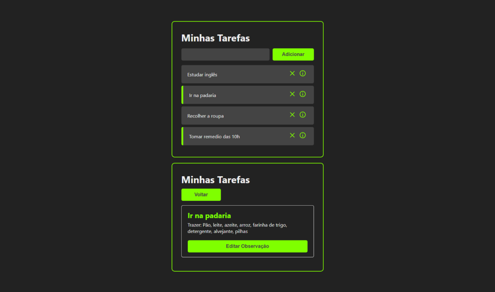

# Tarefas

Para não esquecer mais da lista à fazer, este projeto salva no localstrage cada task e seus detalhes. Permitindo adicinar novas, excluir e editar, foi desenvolvido em ReactJS e utiliza o Local Storage para armazenar as informações.

## 🖼️ Preview



[🔗 Clique aqui para acessar](https://guylhermed.github.io/tarefas-react/)

## 🚀 Começando

Essas instruções permitirão que você obtenha uma cópia do projeto em operação na sua máquina local para fins de desenvolvimento e teste.

### 📋 Pré-requisitos

Possuir instalado em sua máquina o [NodeJs](https://nodejs.org/en)

### 🔧 Instalação

Primeiramente clone o projeto para sua máquina.

Após abrir o projeto em sua IDE instale as dependências do projeto utilizando:

```
npm install
```

Instaladas as dependências, execute o projeto utilizando:

```
npm run dev
```

## 🛠️ Construído com

* [React JS](https://react.dev/) - Framework JavaScript
* [Vite](https://vitejs.dev/) - Empacotador de Módulos para JavaScript
* [Local Storage](https://guylhermed.github.io/tarefas-react/) - Armazena as informações utilizadas

## ✒️ Autores

* **Guylherme Neves Duarte** - [@guylhermed](https://github.com/guylhermed)

## ✉️ Contato

* **Email** - guylherme_duarte@hotmail.com